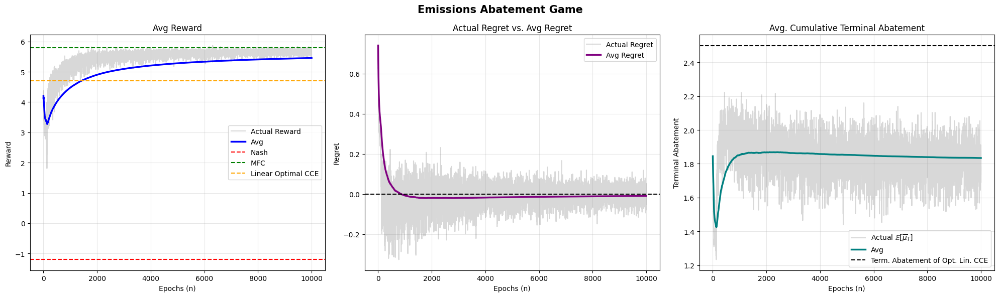

# Learning Algorithm for Mean-Field CCE

[](https://github.com/JannTzou/Learning-Algorithm-for-Mean-Field-CCE/actions/workflows/tests.yml)

Experimental JAX implementation of primal-dual no-regret learning for optimal coarse correlated equilibria in continuous-time mean-field games.

This repository accompanies the paper:

> Luciano Campi, Federico Cannerozzi, and Ioannis Tzouanas,
> [Optimal Coarse Correlated Equilibria in Mean Field Games: Linear Programming and No-Regret Learning](https://arxiv.org/abs/2606.20062), 2026.

## Overview

A mean-field coarse correlated equilibrium (CCE) is a randomized recommendation scheme from which a representative player cannot benefit by committing in advance to ignore the recommendation.

The accompanying paper:

* introduces optimal mean-field CCEs;
* formulates their computation through linear programming;
* establishes existence and characterization results;
* develops a primal-dual no-regret learning algorithm;
* illustrates the method through numerical experiments.

This repository contains an experimental JAX implementation of the learning component, including neural recommendation policies, external-regret estimation, primal-dual training, checkpointing, diagnostics, and automated tests.

## Current scope

The current runnable pipeline supports the emissions-abatement experiment. It provides:

* a JAX/Flax neural recommendation policy;
* Monte Carlo estimation of rewards and external regret;
* projected primal-dual updates;
* resumable training checkpoints;
* training-history export to JSON;
* diagnostic plots for rewards, regret, objectives, and the dual variable.

Additional numerical figures, including the flocking benchmark, are available in `results/figures`. Their full reproduction scripts are not yet included in the runnable pipeline.

## Installation

Python 3.11 is recommended.

```bash
git clone https://github.com/JannTzou/Learning-Algorithm-for-Mean-Field-CCE.git
cd Learning-Algorithm-for-Mean-Field-CCE

python3.11 -m venv .venv
source .venv/bin/activate

python -m pip install --upgrade pip
python -m pip install -e ".[dev]"
```

## Quick verification

Run the automated tests:

```bash
python -m pytest
```

Run a small two-epoch experiment:

```bash
python experiments/emissions_abatement/run.py --quick
```

The quick run verifies the complete pipeline without launching the computationally larger experiment.

## Full emissions-abatement experiment

Run the default experiment with 1,000 epochs and 20 Monte Carlo samples per epoch:

```bash
python experiments/emissions_abatement/run.py
```

The computational cost depends on the machine and JAX backend. The main settings can be changed explicitly:

```bash
python experiments/emissions_abatement/run.py \
    --epochs 500 \
    --mc-samples 10 \
    --seed 0
```

To continue an interrupted run from its latest checkpoint:

```bash
python experiments/emissions_abatement/run.py --resume
```

## Generated outputs

The experiment creates:

```text
outputs/emissions_abatement/
├── full/
│   ├── checkpoint.pkl
│   ├── history.json
│   └── training_diagnostics.png
└── quick/
    ├── checkpoint.pkl
    ├── history.json
    └── training_diagnostics.png
```

The `outputs/` directory is ignored by Git so that local checkpoints and generated runs are not committed accidentally.

## Repository structure

```text
.
├── experiments/
│   └── emissions_abatement/
│       └── run.py
├── paper/
│   └── manuscript.pdf
├── results/
│   ├── README.md
│   └── figures/
├── src/
│   └── mfcce/
│       ├── checkpointing.py
│       ├── config.py
│       ├── networks.py
│       ├── objectives.py
│       ├── plotting.py
│       └── training.py
├── tests/
├── CITATION.cff
├── LICENSE
├── pyproject.toml
└── requirements.txt
```

## Numerical results

Example emissions-abatement results from the paper are available in `results/figures`.



## Automated testing

GitHub Actions installs the package, runs the test suite, and executes the quick emissions-abatement experiment after every push and pull request.

Local tests can be run with:

```bash
python -m pytest
```

## Citation

If you use this repository, please cite the accompanying paper. Citation metadata are also provided in `CITATION.cff`.

```bibtex
@article{campi2026optimal,
  title={Optimal Coarse Correlated Equilibria in Mean Field Games:
         Linear Programming and No-Regret Learning},
  author={Campi, Luciano and Cannerozzi, Federico and Tzouanas, Ioannis},
  journal={arXiv preprint arXiv:2606.20062},
  year={2026}
}
```

## License

See the `LICENSE` file for the terms under which this repository is distributed.
